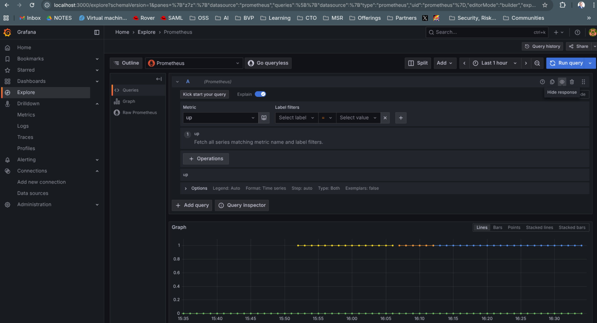

# Bootstrap

In this phase bootstrapping is about creating a simple test harness for all the chosen permutations across 
- Models including model architecture and model modality and a combination thereof 
- Model enhancement (RAG, finetuning, sparsity (MoA/MoE, teacher/student, self-learning)

The aim is to test the approaches for performance across:
- Failure Perception
-- Failure Prevention
-- Failure Prediction
-- Anomaly detection

- Root Cause Analysis (RCA)
-- Failure Localization
-- Failure Category Classification
-- Root Cause Report Generation

- Assisted Remediation
-- Assisted Questioning
-- Mitigation Solution Gneration
-- Command Recommendation
-- Script Generation
-- Automatic Execution

## bootstrapping architecture

The idea is to have a simple podman based container harness consisting of the following:
- 3 containers based on local container builds for the remote location in order to setup the distributed environment
- A single central log and metrics aggregation container to trigger model training and inference
- Secure OTEL based communication between all containers
- Benchmarking against selected benchmarks

### bootrap build
- build your remote containers (remote folder)
```
podman build -t otel-aiops-edge:v1 .
podman run -p 4317:4317 -p 4318:4318 -p 8889:8889 localhost/otel-aiops-edge:v1 🔭
```
The traces, metrics & logs exporters are configured to debug and otlp to allow for local and remote introspection of the telemetry data.

- build your centralized telemtery collection point otel-lgtm
```
git pull https://github.com/grafana/docker-otel-lgtm
cd docker
podman build -t otel-lgtm:latest .
podman images #to see if your image is indeed present

podman run -d \                                                                         ─╯
  -p 3000:3000 \      
  -p 4317:4317 \
  -p 4318:4318 \
  -p 9091:9090 \
  -p 9093:9093 \
  -p 3100:3100 \
  -p 4100:4100 \
  -p 6831:6831/udp \
  -p 6832:6832/udp \
  --name otel-lgtm-instance \
  otel-lgtm:latest
```

to test your setup connect to your grafana dashboard on port `3000` and query for Up to see if you are receving the telemetry data as expected.




